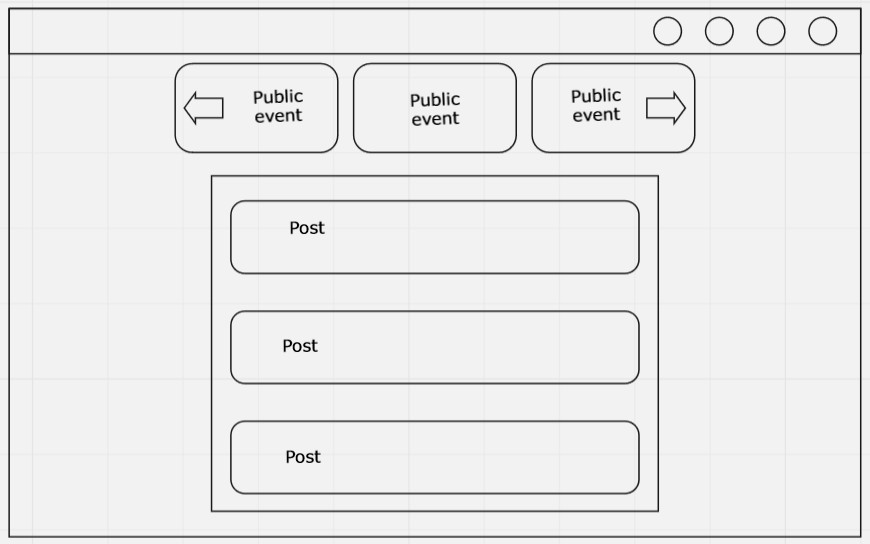
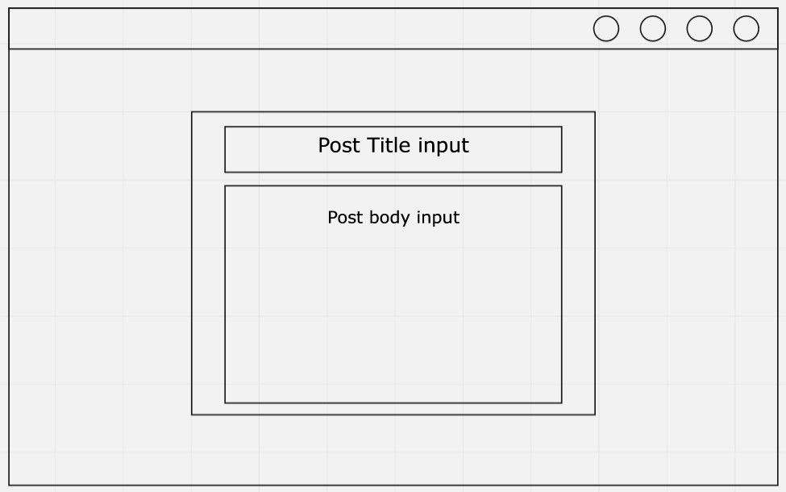
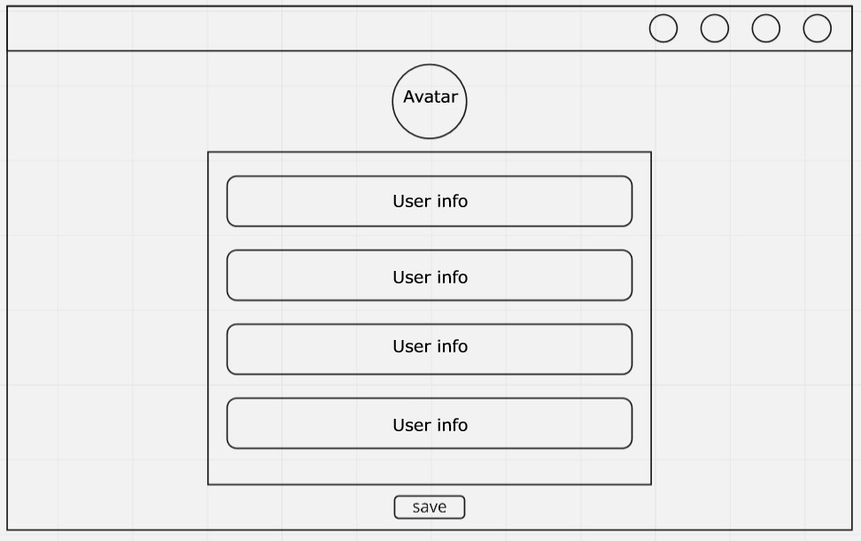
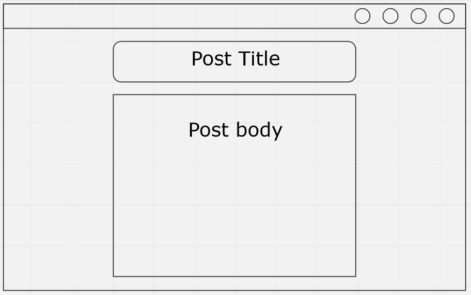
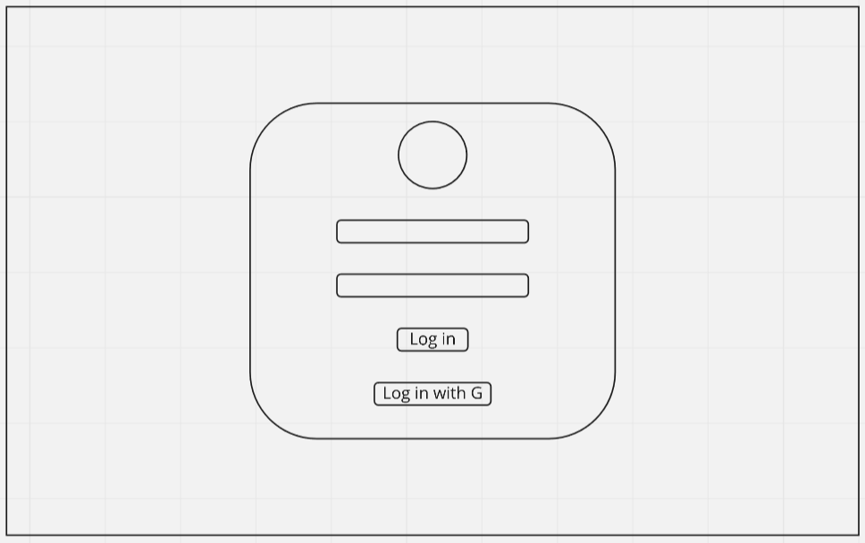
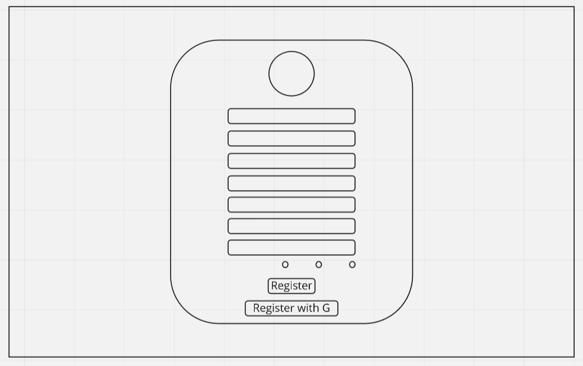

<p align="center">
  <a href="#" rel="noopener">
 </a>
</p>

<!-- <h2 align="center">Partify</h2> -->

<div align="center">

[]()
[](https://github.com/rakenduste-programmeerimine-2021/partify/issues)
[](https://github.com/rakenduste-programmeerimine-2021/partify/pulls)
[](/LICENSE)

</div>

---

<p align="center"> App for sharing/searching parties.
    <br> 
</p>

## 📑 Table of Contents

- [About](#about)
- [Wireframes](#wireframe)
- [Getting Started](#getting_started)
- [Usage](#usage)
- [Built Using](#built_using)
- [Authors](#authors)
- [Acknowledgments](#acknowledgement)
<!-- - [Deployment](#deployment) -->
<!-- - [TODO](../TODO.md) -->

## 🧐 About <a name = "about"></a>

  Most parties and nights out consist of only you and your friends, aka people you know. Project Partify helps you find new people to party with. The projects purpose is to create a platform to make it easier for tourists, people from out of town or just people who want to make new friends to find companions for a night out. 

## 📝 Wireframes <a name = "wireframe"></a>

  
  
  
  
  
  


## 🏁 Getting Started <a name = "getting_started"></a>

These instructions will get you a copy of the project up and running on your local machine for development and testing purposes. 
<!-- See [deployment](#deployment) for notes on how to deploy the project on a live system. -->

### Prerequisites

What things you need to install the software.


* [Docker](https://www.docker.com/) version => 20


### Installing

A step by step series of examples that tell you how to get a development env running.

Downlaoding project and running it.

```
$ git clone https://github.com/rakenduste-programmeerimine-2021/partify.git
$ cd partify/local-dev
$ docker-compose up
```

<!-- ## 🔧 Running the tests <a name = "tests"></a>

Explain how to run the automated tests for this system.

### Break down into end to end tests

Explain what these tests test and why

```
Give an example
```

### And coding style tests

Explain what these tests test and why

```
Give an example
``` -->

## 🎈 Usage <a name="usage"></a>

For example if you are visiting Tallinn, you can filter the posts by Tallinn and see what people are up to; who is looking to party, who is hosting a party; what are the public events and so on. You can find companions and even make new friends through our platform.

<!-- ## 🚀 Deployment <a name = "deployment"></a>

Add additional notes about how to deploy this on a live system. -->

## ⛏️ Built Using <a name = "built_using"></a>
- [Docker](https://www.docker.com/) - Container
- [MongoDB](https://www.mongodb.com/) - Database
- [Express](https://expressjs.com/) - Server Framework
- [React](https://reactjs.org/) - Web Framework
- [NodeJs](https://nodejs.org/en/) - Server Environment

## ✍️ Authors <a name = "authors"></a>

- [@Karl Janar Kinkar](https://github.com/karljanar)
- [@Torm Erik Raudvee](https://github.com/tormrdv)

See also the list of [contributors](https://github.com/rakenduste-programmeerimine-2021/partify/graphs/contributors) who participated in this project.

## 🎉 Acknowledgements <a name = "acknowledgement"></a>

- Hat tip to anyone whose code was used
